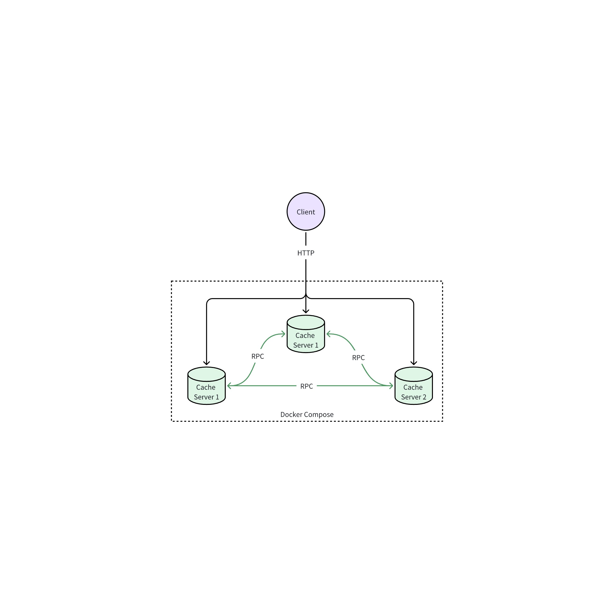

# Simple Distributed Cache System (SDCS)

SDCS is a straightforward distributed cache system designed to store and retrieve key-value pairs efficiently.

## Environment Requirements

Ensure that your system meets the following requirements:

| Operating System | Docker Version | docker-compose Version |
| ---------------- | -------------- | ---------------------- |
| Ubuntu 20.04     | 24.0.5         | 1.25.0                 |

## Project Structure

The project has the following structure:

```bash
.
├── docker-compose.yml
├── Dockerfile
├── proto
│   └── kvstore.proto
├── scripts
│   └── start_kvstore.sh
├── src
│   ├── grpc_server.py
│   └── http_server.py
└── test
    └── sdcs-test.sh
```

## Project Description

SDCS, built with gRPC and Python, provides a simple way to store and retrieve key-value pairs. Each server node can handle requests and has the capability to forward requests to other nodes.



## Installation & Testing

Follow these steps to install and test SDCS:

```bash
git clone https://github.com/zhgaocs/sdcs.git
cd sdcs/
docker-compose build
docker-compose up -d
```

To test SDCS, download the `sdcs-test.sh` script from [here](https://github.com/ruini-classes/sdcs-testsuit) and then execute the following commands:

```bash
chmod +x sdcs-test.sh
./sdcs-test.sh
```
